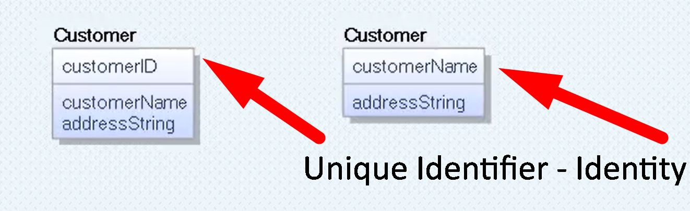
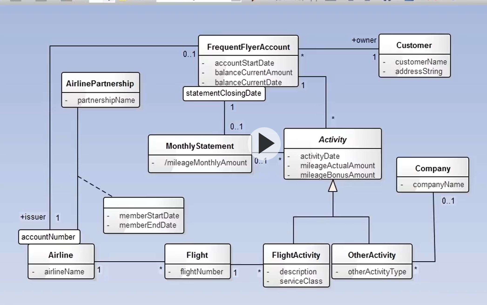
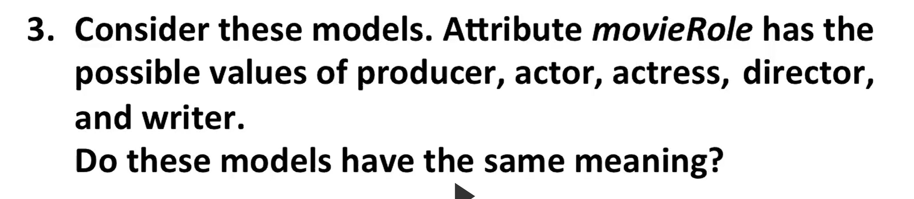
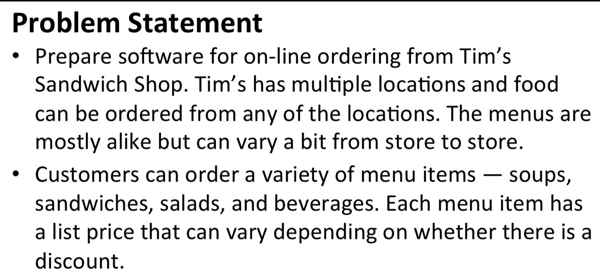
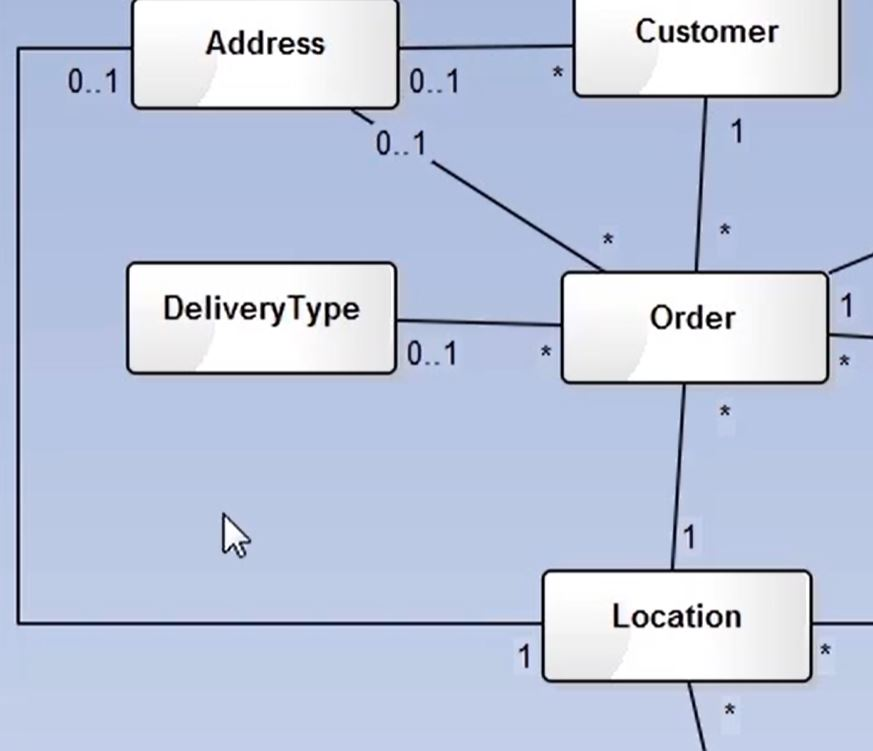
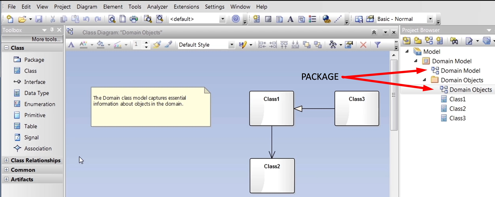
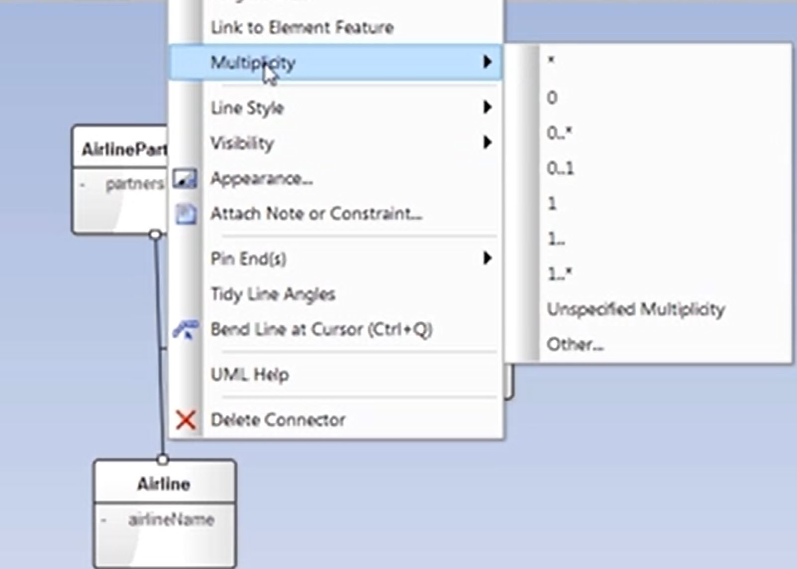
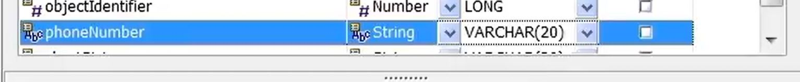
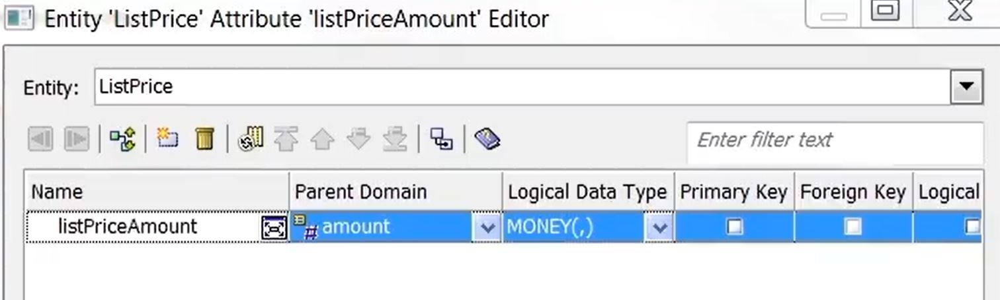

# Data Modeling

## Notes from Infinite Skills Data Modeling Course

### Overview

Overview

1. Development Process
    1. Ascertain business requirements (**busreq**)
    1. Apply busreq's to creating data model
    1. Use **data model** to create **database design**
    1. Use **database design** to implement **database**
1. Two notations
    1. UML for Data Modeling
        1. from Enterprise Architect tool
    1. IE for database design
        1. from Erwin tool
1. Two advanced topics
    1. Data Modeling Patterns
    1. Database Reverse Engineering
1. DBMS
    1. Performance
        1. General Purpose Logic
        1. Concurrent access
        1. Data integrity
        1. Crash Recovery
        1. Data security
    1. Protects against
        1. Programming mistakes
        1. Hardware Failure
        1. Networking Failure
1. Relational Database
    1. Data is read from tables
    1. Tables have number of columns
    1. Tables can have infinite rows
    1. Data entries are the intersection between row and column
    1. Tables can create unique data by matching fields and foreign keys with others
1.  Why focus on Data Models
    1. Reduce Cost
    1. Increase Quality of product
    1. Increase Product production
    1. Increase data performance
    
    

### Data Model Development Process

Chapter

#### 1. Data Model Notations

1. UML
    1. Unified Modeling Language
    1. Ideal for
        1. conceiving **database models**
    1. Example
        1. 
1. IE
    1. Information Engineering
    1. Ideal for
        1. specific details of **database design**
    1. Example
        1. 

#### 2. UML Versus IE - Conceptual, Logical, and Physical

1. Three Models
    1. Conceptual data model
        1. major entity types
        2. relationship types
    1. Logical data model
        1. attribute types
        1. minor entity types
    1. Physical
        1. Database Design
            1. tables
            1. keys
            1. indices
            1. constraints
1. UML is for
    1. Conceptual 
    1. Logical
1. IE is for
    1. Physical
1. UML is used when...
    1. Researching BusReq
    1. Generate content / scope
1. IE is used when ...
    1. Genereate Code

### Basic Data Modeling

Expand

#### 1. Class and Attribute

1. Object
    1. Concept that has **IDENTITY** and **MEANING** within application
    1. ALSO KNOWN AS... Data
        1. Data Entry
1. Class
    1. Grouping of similar objects
    1. ALSO KNOWN AS... MetaData
        1. Data Table

1. Using UML technology
    1. Creating a new Class / Table
        1. 
        1. 
        1. 
    1. Class and Attribute
        1. 
        1. 
        1. 
    1. BOTH IE and UML...
        1. Have value and attribute
    1. Create a IE entity type
        1. 
        1. 
        1. 
        1. 
        1. 

#### 2. Operation

1. Basic Definition
    1. Function that is applied to/by classes
1. Using within UML
    1. 
    1. 
    1. 

#### 3. Domain

1. Basic Definition
    1. Named set of possible values
        1. Also consider `data type`
        1. specification of attribute's type/size in value
1. Using Domains in IE
    1. 
    1. 
1. Applying Domain to Attributes in IE
    1. 
    1. 

#### 4. Association Name

1. Basic Defintion
    1. Group of links with common structure / meaning
1. Implemented with
    1. Link
        1. a relationship amoung objects
1. Implement Links within UML
    1. 
    1. 
1. UML vs IE
    1. UML Link
        1. IE Relationship
    1. UML Association
        1. IE Relationship Type
1.  Implement Relationships within IE
    1. 
    1. 
    1. 
    1. 

#### 5. IE Entity Type and Relationship Type

1. Different types
    1. Independent entity type
        1. Primary Key <ins>** NOT INCLUDE**</ins> Foreign Keys
    1. Dependent entity type
        1. Primary Key <ins>**INCLUDES**</ins> Foreign Keys
    1. Difference in IE 
        1. 

#### 6. Association Name

1. Naming Links in UML
    1. 
    1. 
    1. 
    
1. Naming Relationships in IE
    1. 
    1.  
    1. 

#### 7. Association End

1. Basic Definition
    1. Association with a related class
1. Implementing within UML
    1. 
    1. 
    1. 
1. Implementing within IE
    1. 
    1. 
    1. 

#### 8. Multiplicity - UML

1. Number of occurances <ins>of one class</ins>
    1. relating to a single occurence
        1. <ins>of an associated class</ins>
1. Within UML
    1. creating ONE person IN a FreqFlyAccount
        1. 
    1. creating many FreqFlyAccounts PER Persone
        1. 
    1. OVERVIEW
        1. 
    1. MAY or MAY NOT = 0.1
        1. 

#### 9. Multiplicity - IE

1. Within IE
    1. 
    1. 
    1. 

#### 10. Generalization - UML

1. Basic Defintion
    1. Creating and differentiating different subclasses within a class
        1. can go forever with levels of subclasses
    1. Example
        1. Airline has general grouping of flights classified as "Activity"
            1. where it needs to track milages
        1. HOWEVER... `"Activity"` can be broken to two subcategories - `FlightActity` and `OtherActivity`
            1. FA needs a field of `serviceClass`
            1. OA needs a field of `activityType`
    1. Implementing Example in UML
        1. 
        

#### 11. Generalization - IE

1. Difference of IE
    1. Instead of superclass(UML)
        1. It is called supertype(IE)
    1. Instead of subclass(UML)
        1. It is called subtype(IE)

1. Implementing in IE (Erwin)
    1. 
    1. 
    1. 
    
    

#### 12. Abstract vs. Concrete Superclass

1. Difference
    1. Abract shows <ins>**all**</ins> subclasses
    1. Concrete shows <ins>**some**</ins> subclasses
1. Implementing Abstract within UML
    1. 
    1. 
    1. 

#### 13. Practical Tips

1. Need to clearly know the Scope/Responsibility of the Database / Customer
1. Understand purpose dictates level of ...
    1. polish
    1. completeness
    1. amount of time
1. Be cautious of names
1. Create lexicon
1. Generalization ONLY if subclasses need differentiation

#### 14. Self Assessment

1. 
1. 
1. 
    1. 
1. Which one is the better model
    1. 
1. 
    1. 

### Advanced Data Modeling

Expand

#### 1. Identity

1. Definition
    1. Property of Object
    1. Distinguishes Object from Others
1. Different between UML and IE
    1. UML
        1. 
    1. IE
        1. Existance Based Identity
            1. Identifier Code is automatically generated upon entry
        1. Value Based Identity
            1. Identity consist of real world attributes make up primary key
                1. PROBLEM... lack of attributes leads to problems

#### 2. Derived Data

1. Data computed by stored data
    1. Age from birth date
    1. Pros
        1. More data
    1. Cons
        1. More complications
        1. More bulk
1. Within UML
    1. **milageMonthlyAmount** is derived from **FreqFlyAccount** divided by **30 days**
    1. 
    1. 

#### 3. Current Versus Historical Data

1. Design Decision
    1. Does historical data matter?
        1. Will having a history of past addresses help in any capacity?
        1. Will it hinder or complicate data?
1. 

#### 4. Association Class

1. UML Implementation
    1. 
    1. 
    1. 
    1. 
    1. 
    1. 
1. IE Implementation
    1. 
        1. Identifying relationship = solid line
        1. Non-identifying relationship = dotted line
    1. 
    1. 
        1. ordinary class has UNIQUE IDENTIFIER
    1. Association Class vs Ordinary Class
        1. Association Class
            1. When you want the latest pairing
                1. BUILT INTO IT'S PRIMARY KEY
        1. Ordinary Class
            1. When you want history pairing
                1. History is DISASSOCIATED from PRIMARY KEY

#### 5. Ordered Association

1. Basic Definition
    1. Association that imposes sequencing on Many Association end
1. IE - no ordered association - but combine sequence and AK
    1. 
    1. Adding a sequence number
        1. 
        1. 
        1. 
    1. Combining `flightId` and `sequenceNumber` to form a unique ID
        1. 
        1. 
        1. 
        1. 

#### 6. Qualified Association -(UML)

1. Basic definition
    1. qualifier is an attribute used to identify individual entry
    1. qualified association is a link where all entrys have a qualifier attribute to distinquish themselves in a many association end
1. Within UML
    1. 
    1. 
    1. WARNING WE A USING A DUPLICATE... TWO LOCATIONS FOR `accountNumber`
        1. 
    1. 

#### 7. Qualified Association -(IE)

1. Adding a Qualifier - Via `Constraint`
    1. 
    1. 
    1. 
    1. 
1. Adding `AccountNumber` and `IssuerID`, you get a unique FreqFlyerAccount

#### 8. Large Taxonomies

1. More subject = Larger taxonomies
    1. Hard to comprehend
    1. Instable
    1. A lot of effort
1. Avoid larger than 20 classes
    1. Shift abstraction and use metadata
        1. 
    1. 

#### 9. Package

1. What do you do with a LARGE MODEL
    1. Large diagram of smaller pieces
    1. Division of lesser diagrams, model is spread amongst smaller diagrams
1. UML
    1. Does option 1
1. IE
    1. Does both
1. Lesser Diagram = package
    1. Package = anything made of elements
        1. elements = classes / associations / generalizations
1. Examples
    1. Since, FreqFlyer Model can fit in one page
        1. 
    1. These is no need... but if you need to... 
        1. 
1. In IE... it's called subject area

#### 10. Abridged UML Metamodel

1. Used to review
    1. 
        1. Only shows attributes relevant for associations or generalizations

#### 11. Abridged IE Metamodel

1. Used to review
    1. 

#### 12. Modeling Pitfalls

1. Do **NOT** create a class for a reference
    1. **USE** reference ends
        1. 
1. Avoid parallel attributes
    1. 
1. Avoid **anonymous** attributes
    1. 
1. Avoid Symmetric Associations
    1. Same multiplicity on both ends
    1. 
    1. 
1. Avoid 20+ classes and large models

#### 13. Practical Tips

1. Pay attention to identity
1. Use of existence-based identity
1. Avoid Derived data
1. Qualifier for many assoiciations
1. Avoid large models [4 deep]
1. Aim for simplicity
1. Model review constantly

#### 14. Assessment Test -  Advanced Modeling

1. 
    a. 
    b. 
    c. 
        1. 
1. 
    1. Checking account = existence based identity
    1. Statement = value based identity
    1. 
1. 
    1. 
    1. depends on data 
        1. merely role = wrap
        1. many movie to many people
        1. single movie to many people
1. 
    1. Cascade of qualifications can occur
1. 
    1. Yes. Generalization is allowed. Never exceeds 4 layers or 20 classes.
    1. 

### UML Data Modeling

Expand

#### 1. Problem Statement

1. First Example
    1. 
    1. 
    1. 

#### 2. Finding Classes

1. Read about Ordering Food --> create order class
    1. 
1. Read about one sandwich shop brand with multiple  locations
    1. 
1. Read about multiple menu
    1. 
1. Read about customers
1. Read about menuItems
1. Read about ListPrice
1. Read about Discount
1. Read about Sandwich with bread, cheese, meat
1. Read about Delivery
1. Read about Address
1. Read about Payment and CreditCard
    1. 

#### 3. Finding Associations - Part 1

1.  Think about relationships one at a time
    1. What is the Relationship Between **Order** and **SandwichShop**  website [think in both directions]
        1. One **SandwichShop** website has Many **Orders**
        1. One **Order** has ONLY One **SandwichShop**
        1. Therefore...
            1. One to Many
                1. 
    1. What is the Relationship Between **SandwichShop**  website and **Location** [think in both directions]
        1. One **SandwichShop** website has Many **Location**s
        1. One **Location** has ONLY One **SandwichShop** website
        1. Therefore...
            1. One to Many
                1. 
    1. PROBLEM!! 
        1. What is wrong with this picture?
            1. 
        1. Solution
            1. Orders are based on location NOT ON WEBSITE
            1. 
        1. Moral of the story
            1. Dependency dictates order
    1. Where does **Menu** fit in with **Order**, **SandwichShop**  website and **Location** 
        1. How to break it down
            1. Where does **Menu** vary the most?
        1. **Menu** varys the most with **Location**
            1. 
            
    1. How Does **MenuItem**, **ListPrice** and **Discount** Relate to One Another?
        1. **ListPrice** varies based on **Discount**
        1. **MenuItem** has one **ListPrice**
        1. **MenuItem** can have many **Discount**
        1. **Discount** can apply to many **MenuItem**
        1. 

#### 4. Finding Associations - Part 2

1.  Think about relationships one at a time
    1. What is the Relationship Between **Order** and **Delivery** [think in both directions]
        1. A **Order** MAY or MAY NOT have a means of **Delivery**
        1. **Delivery** method can have many **Orders**
        1. Therefore...
            1. Optional to Many
                1. 
    1. Where does Address fit in? With **Order**? Or with **Delivery**?
        1. It belongs with **Order**.
        1. Since orders can be picked up... 
            1. **Order** MAY or MAY NOT have **Address**
            1. **Address** can be in MANY **Order**'s
                1. 
    1. Where does **Address** fit with **Customer**?
        1. **Address** can have MANY **Customer**
            1. Friend ordering pizza for you
        1. **Customer** MAY or MAY NOT have an **Address**
            1. 
    1. How does **Payment** and **CreditCard** relate to one another?
        1. **Payment** MUST HAVE ONE **CreditCard**
        1. **CreditCard** can apply to MANY **Payment** 
            1. 
    1. How does **Payment** and **Order** relate to one another?
        1. **Payment** can only apply to ONE **Order**
        1. **Order** MAY or MAY NOT have **Payment**
            1. 
    1. How does **Location** and **Address** relate to one another?
        1. **Location** of Sandwich Shop MAY or MAY NOT have an **Address**
        1. **Address** of Sandwich Shop can only be in ONE **Location** 
            1. 
1. Complete Picture
    1. 
    
    
        

#### 5. Finding Generalizations

1. Two ways of finding generalization
    1. Top-down
        1. Requirements dictate structure
    1. Bottom-Up
        1. Models can dictate structure

1. Top-down
    1. Requirement - online ordering
        1. Foods make up the MenuItem
            1. 

#### 6. Iterating And Refining The Model - Part 1

1. Problem - Order can consist of MANY **MenuItem**'s
    1. Two Approaches
        1. Edit the association obetween **Order** and **MenuItem**
            1. Include **quantity** as an attribute
        1. Create another class... **OrderItem**
            1. WHY... symmetry
                1. **Menu** ... **MenuItem**... 
                **Order**... **OrderItem**
            1. 

1. Problem -- how to transfer cost
    1. `OrderItem` needs to be broadened to incl. delivery, sales tax
        1. THEREFORE a `OrderItem` MAY OR MAY NOT have a `MenuItem`
    1. `OrderItem` needs to include the cost AFTER discount
        1. Need to add an attribute of `orderItemAmount`
    1. 

#### 7. Iterating And Refining The Model - Part 2

1. More abstraction for fooditems to incl sauces, type of drink
    1. broadened to be `ItemIngredient`
        1. to include `topping` and `bread` categories
    1. broaded to incl. `IngredientChoice`
        1. to include `white` and `rye` bread
    1. 
1. Problems... can't add constraints... chicken sandwich can become a meatball sandwich
    1. SOLUTION - will be low level code... need to add notes for developers to restrain `IngredientChoice` based on `MenuItem`

#### 8. Adding Attributes

1. Overall workflow
    1. Problem statement focuses on `class` and `associations`
    1. Modeler will need to think through `attributes` of both `class` and `associations`
1. 

#### 9. Cleaning Up Layout

1. 

#### 11. Simplifying The Model

1. Always consider using metadata via specifying every class/subclass

1. Three tiers of data change
    1. Database is hardest
    1. Application is medium
    1. UI is easiest

#### 12. Evolving A Model - Part 1

1. Always look at other apps for ideas
1. Consider guest / sign-in checkout
    1. consider an account-less customer
    1. Account customers
        1. can store credit-cards and addresses
        

#### 13. Evolving A Model - Part 2

1. Adding ad-hoc and account customer
    1. Account customer gets the `address` `perferredAddress` `creditcards` and `perferredCredit`
        1. 
    

#### 14. Enterprise Architect Techniques - Part 1

1. Creating a Blank Project
    1. 
    1. 
    1. 

#### 15. Enterprise Architect Techniques - Part 2

1. Creating a package
    1. 
1. Implementing classes
    1. 
    1. Right-click to add attributes
        1. 
1. Copying class from another package
    1. Left-click from Project Browser... drag into your workspace

#### 16. Enterprise Architect Techniques - Part 3

1. Specify multiplicity
    1. 

### UML into IE Data Modeling

Expand

#### 1. Creating Subject Areas

1. IE takes more space...
    1. If UML is crowded... expect IE to be split
        1. Split based on `Subject Areas`
1. Two subject Areas
    1. Order
        1. 
    1. OrderItem
        1. 
1. When using subject areas...
    1. Think of how they are connected
        1. 

#### 2. Creating Entity Types

1. Create SubjectAreas
    1. 
1. Create Entities within Order
    1. 
1. Create Entities within OrderItem
    1. 

#### 3. Creating Domains

1. Create `objectIdentifier` that is...
    1. Domain parent of **number**
    1. Logical data type of `Long`
        1. 
    1. 
    1. 
    1. 
    1. 
    1. 
    1. 
    1. 
    1. 
    1. 
    1. 
    1. 
    1. 
    1. 

#### 4. Adding Attributes - Part 1

1. Add attributes to each class, domain for each attribute
    1. 
    1. 
    1. 
1. Work on
    1. Account Number
        1. 
    1. Order
        1. 
    1. Delivery Type
        1. 
    1. Location
        1. 
    1. SandwichShop
        1. 
    1. Address
        1. 
    1. Creditcard
        1. 
    1. Payment
        1. 
    

#### 5. Adding Attributes - Part 2

1. More attributes
    1. 
    1. 
    1. 
    1. 
    1. 
    1. 
    1. 
    1. 

#### 6. Creating Relationship Types - Part 1

1. Non Identifying relationship from `Customer` to `Order`
    1. 
    1. 
1. 
1. 
1. 

#### 7. Creating Relationship Types - Part 2

1. Problem...
    1. Account Customer does NOT have a PK
1. Location NEEDS an Address
    1. 

#### 8. Creating Relationship Types - Part 3

1. 

#### 9. Subtyping

1. 

#### 10. Adding Alternate Keys

1. Right click -> Key Group Properties -> Button 'New' -> new alternate key
    1. Good Idea to pick names
        1. 
    

#### 12. ERwin Techniques - Part 1

1. Blank
    1. Go for Logical
1. Difference between Logical / Physical
    1. Available commands
        1. Logical can reverse engineer
        1. Physical
            1. Target a database
            1. Forward Engineer to generate schema
        

#### 13. ERwin Techniques - Part 2

1. Copy a table
    1. 
1. 

### Model Quality

Expand

#### 1. Model Quality

1. Determine database structure
1. Choice of representation
    1. Define difficulty
1. Choices
    1. Normal Form
        1. Defines consistency
    1. Constraint
        1. Boolean condition that data myst satisfy for database storage
    1. Hillard's graph complexity
        1. Equates data model to a undirected graph
        1. Computes complexity
    1. Hoberman's data quality score

#### 2. Normal Forms

1. Guideline for data consistency amoung tables during updates
    1. Types
        1. First
        1. Second
    1. 
    1. 
1. When Normal Forms doesn't get the job done
    1. 
    1. 
1. Why violate Normal Form
    1. Used to increase database READ performance

1. Going over Normal Form 
    1. Starting with a Sales Record
        1. 

    1. Attaining <ins>**1st Normal Form**</ins>

        1. Qualities
            1. Each cell = 1 Value
            1. All entities in column... same type
            1. Each row... MUST BE UNIQUELY IDENTIFIES
        1. What is wrong with the example above...
            1. 
        1. What it should look like..
            1. 

1. Going over <ins>**2nd Normal Form**</ins>
    1. Starting with...
        1. 
    1. Attaining <ins>**2nd Normal Form**</ins>
        1. Qualities
            1. All entries ARE DEPENDENT on Primary Key
        1. What is wrong with the example above...
            1. 
        1. What should it look like...
            1. 

1. Going over <ins>**3rd Normal Form**</ins>
    1. Starting with...
        1. 
    1. Attaining <ins>**2nd Normal Form**</ins> 
        1. Qualities
            1. All entries can be determined ONLY... BY... PRIMARY ...KEY
        1. What is wrong with the example above
            1. 
        1. What it should look like?
            1. 

1. Going over <ins>**4th Normal Form**</ins>
    1. Starting with...
        1. 
    1. Attaining  <ins>**4th Normal Form**</ins>
        1. Qualities
            1. No MULTI-VALUED dependencies
        1. What is wrong with the example above
            1. 
        1. What it should look like?
            1. 

#### 3. Constraints

1. Restriction for database storage
    1. Implicit
        1. Qualifier
            1. Required ID 
                1. Airline ID + Account Number
        1. Generalization Discriminator
            1. Enum-like behavior
            1. Only defined ID win Generalization structure 
    2. Explicit

#### 4. Hillard Graph Complexity

1. 
1. How to calculate?
    1. Longest Traversal
    1. More choice = complication
1. Metrics
    1. Order = total nodes
    1. Size = total edges
    1. Degree = number of edges in a node
    1. Geodesic distance = minimum number of nodes to traverse
    1. Average degree = average edges per node
    1. Average geodesic distance = average edges to traverse between all node pairs
    1. Maximum geodesic distance = largest number edges to traverse between all node pairs

1. 

#### 5. Hoberman Data Model Scorecard

1. 
1. 

### Types of Data Models

Expand

#### 1. Operational Data Models

1. Routine operations [thousands of queries]
1. Online Transaction Processing
1. Why important
    1. Allows change
1. To construct
    1. Start with UML
        1. focus on classes
    2. Work on IE based on UML

#### 2. Enterprise Data Models

1. ENTIRE Organization
1. Only focus on most important
1. Simplified Conceptual model
    1. Typical UML
1. Important for.
    1. Organizational vision
    1. Data consistency
    1. Allow for Reuseable components
    1. Data warehouses
1. Construction process
    1. Application content
    1. Review with business staff

#### 3. Data Warehouses - Part 1

1. B

#### 4. Data Warehouses - Part 2

1. 

#### 5. Data Warehouses - Part 3

1. 

#### 6. Master Data Models

1. 

### Database Design

Expand

#### 1. Schema Adjustments

1. 

#### 2. Attribute Details - Part 1

1. 

#### 3. Attribute Details - Part 2

1. 

#### 4. Attribute Details - Part 3

1. 

#### 5. Primary And Alternate Keys

1. 

#### 6. Indexes

1. 

#### 7. Referential Integrity - Part 1

1. 

#### 8. Referential Integrity - Part 2

1. 

#### 9. Check Constraints - Part 1

1. 

#### 10. Check Constraints - Part 2

1. 

#### 11. Views

1. 

#### 12. Other Aspects Of Design

1. 

#### 13. Self Assessment Test

1. 

### Creating SQL Server Database

Expand

#### 1. Creating A New Database

1. 

#### 2. Executing Schema

1. 

#### 3. Inspecting Metadata

1. 

#### 4. Loading Sample Data

1. 

#### 5. Querying Sample Data

1. 

### Creating MS Access Database

Expand

#### 1. Generating An ERwin Schema

1. 

#### 2. Creating Tables

1. 

#### 3. Creating Indexes

1. 

#### 4. Creating Constraints And Default Values

1. 

#### 5. Defining Foreign Keys

1. 

#### 6. Creating Views

1. 

#### 7. Loading Sample Data

1. 

#### 8. Querying Sample Data

1. 

### Software Engineering

Expand

#### 1. Development Frameworks

1. 

#### 2. Agile Data Modelling

1. 

#### 3. Documenting A Model - Part 1

1. 

#### 4. Documenting A Model - Part 2

1. 

#### 5. Presenting A Model

1. 

### Data Modeling Process

Expand

#### 1. Overview

1. 

#### 2. Tree - Hardcoded

1. 

#### 3. Tree - Simple

1. 

#### 4. Tree - Structured

1. 

#### 5. Tree - Overlapping

1. 

#### 6. Tree - Changing Over Time

1. 

#### 7. Tree - Degenerate Node and Edge

1. 

### Database Reverse Engineering

Expand

#### 1. Motives

1. 

#### 2. Comparison With Forward Engineering

1. 

#### 3. Outputs

1. 

#### 4. Inputs

1. 

#### 5. Process

1. 

#### 6. Principles

1. 

#### 7. Example - Part 1

1. 

#### 8. Example - Part 2

1. 

