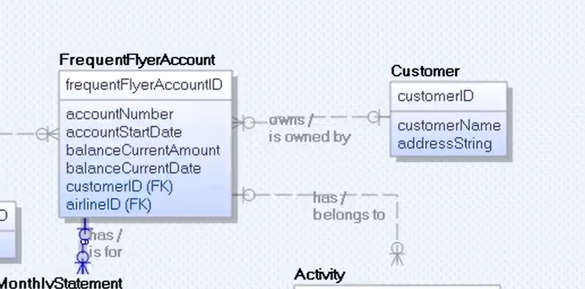

# Data Modeling

## Notes from Infinite Skills Data Modeling Course

### Overview

Overview

1. Development Process
    1. Ascertain business requirements (**busreq**)
    1. Apply busreq's to creating data model
    1. Use **data model** to create **database design**
    1. Use **database design** to implement **database**
1. Two notations
    1. UML for Data Modeling
        1. from Enterprise Architect tool
    1. IE for database design
        1. from Erwin tool
1. Two advanced topics
    1. Data Modeling Patterns
    1. Database Reverse Engineering
1. DBMS
    1. Performance
        1. General Purpose Logic
        1. Concurrent access
        1. Data integrity
        1. Crash Recovery
        1. Data security
    1. Protects against
        1. Programming mistakes
        1. Hardware Failure
        1. Networking Failure
1. Relational Database
    1. Data is read from tables
    1. Tables have number of columns
    1. Tables can have infinite rows
    1. Data entries are the intersection between row and column
    1. Tables can create unique data by matching fields and foreign keys with others
1.  Why focus on Data Models
    1. Reduce Cost
    1. Increase Quality of product
    1. Increase Product production
    1. Increase data performance
    
    

### Data Model Development Process

Chapter

#### 1. Data Model Notations

1. UML
    1. Unified Modeling Language
    1. Ideal for
        1. conceiving **database models**
    1. Example
        1. 
1. IE
    1. Information Engineering
    1. Ideal for
        1. specific details of **database design**
    1. Example
        1. 

#### 2. UML Versus IE - Conceptual, Logical, and Physical

1. Three Models
    1. Conceptual data model
        1. major entity types
        2. relationship types
    1. Logical data model
        1. attribute types
        1. minor entity types
    1. Physical
        1. Database Design
            1. tables
            1. keys
            1. indices
            1. constraints
1. UML is for
    1. Conceptual 
    1. Logical
1. IE is for
    1. Physical
1. UML is used when...
    1. Researching BusReq
    1. Generate content / scope
1. IE is used when ...
    1. Genereate Code

### Basic Data Modeling

Expand

#### 1. Class and Attribute

1. Object
    1. Concept that has **IDENTITY** and **MEANING** within application
    1. ALSO KNOWN AS... Data
        1. Data Entry
1. Class
    1. Grouping of similar objects
    1. ALSO KNOWN AS... MetaData
        1. Data Table

1. Using UML technology
    1. Creating a new Class / Table
        1. 
        1. 
        1. 
    1. Class and Attribute
        1. 
        1. 
        1. 
    1. BOTH IE and UML...
        1. Have value and attribute
    1. Create a IE entity type
        1. 
        1. 
        1. 
        1. 
        1. 

#### 2. Operation

1. Basic Definition
    1. Function that is applied to/by classes
1. Using within UML
    1. 
    1. 
    1. 

#### 3. Domain

1. Basic Definition
    1. Named set of possible values
        1. Also consider `data type`
        1. specification of attribute's type/size in value
1. Using Domains in IE
    1. 
    1. 
1. Applying Domain to Attributes in IE
    1. 
    1. 

#### 4. Association Name

1. Basic Defintion
    1. Group of links with common structure / meaning
1. Implemented with
    1. Link
        1. a relationship amoung objects
1. Implement Links within UML
    1. 
    1. 
1. UML vs IE
    1. UML Link
        1. IE Relationship
    1. UML Association
        1. IE Relationship Type
1.  Implement Relationships within IE
    1. 
    1. 
    1. 
    1. 

#### 5. IE Entity Type and Relationship Type

1. Different types
    1. Independent entity type
        1. Primary Key <ins>** NOT INCLUDE**</ins> Foreign Keys
    1. Dependent entity type
        1. Primary Key <ins>**INCLUDES**</ins> Foreign Keys
    1. Difference in IE 
        1. 

#### 6. Association Name

1. Naming Links in UML
    1. 
    1. 
    1. 
    
1. Naming Relationships in IE
    1. 
    1.  
    1. 

#### 7. Association End

1. Basic Definition
    1. Association with a related class
1. Implementing within UML
    1. 
    1. 
    1. 
1. Implementing within IE
    1. 
    1. 
    1. 

#### 8. Multiplicity - UML

1. Number of occurances <ins>of one class</ins>
    1. relating to a single occurence
        1. <ins>of an associated class</ins>
1. Within UML
    1. creating ONE person IN a FreqFlyAccount
        1. 
    1. creating many FreqFlyAccounts PER Persone
        1. 
    1. OVERVIEW
        1. 
    1. MAY or MAY NOT = 0.1
        1. 

#### 9. Multiplicity - IE

1. Within IE
    1. 

#### 10. Generalization - UML

1. 

#### 11. Generalization - IE

1. 

#### 12. Abstract vs. Concrete Superclass

1. 

#### 13. Practical Tips

1. 

#### 14. Self Assessment

1. 

### Advanced Data Modeling

Expand

#### 1. Sub-chapter

1. 

#### 2. Sub-Chapter

1. 

### UML Data Modeling

Expand

#### 1. Sub-chapter

1. 

#### 2. Sub-Chapter

1. 

### UML into IE Data Modeling

Expand

#### 1. Sub-chapter

1. 

#### 2. Sub-Chapter

1. 

### Model Quality

Expand

#### 1. Sub-chapter

1. 

#### 2. Sub-Chapter

1. 

### Types of Data Models

Expand

#### 1. Sub-chapter

1. 

#### 2. Sub-Chapter

1. 

### Database Design

Expand

#### 1. Sub-chapter

1. 

#### 2. Sub-Chapter

1. 

### Creating SQL Server Database

Expand

#### 1. Sub-chapter

1. 

#### 2. Sub-Chapter

1. 

### Creating MS Access Database

Expand

#### 1. Sub-chapter

1. 

#### 2. Sub-Chapter

1. 

### Software Engineering

Expand

#### 1. Sub-chapter

1. 

#### 2. Sub-Chapter

1. 

### Data Modeling Process

Expand

#### 1. Sub-chapter

1. 

#### 2. Sub-Chapter

1. 

### Database Reverse Engineering

Expand

#### 1. Sub-chapter

1. 

#### 2. Sub-Chapter

1. 

